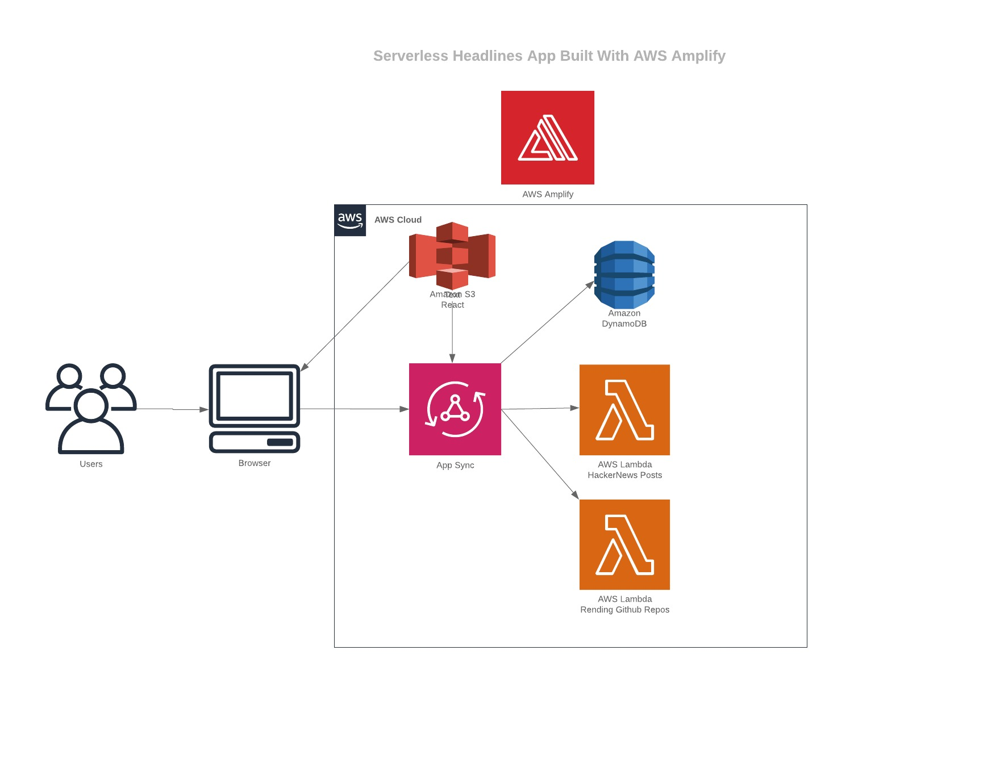

## Description
A serverless headlines and todo demo app deployed 100% with AWS amplify with React as a front-end. Optionally add IOpipe for detailed monitoring of your Lambda functions. 


The front end react app is stored in an S3 bucket. There are two endpoints on AWS AppSync that have a Lambda function as a resolver. One endpoint `/hackerNews` gets the top 10 posts current listed at [Hacker News](https://news.ycombinator.com/). The other endpoint, `/trending-github-repos` with get the top 10 trending repositories of the day.

There is also the `/todos` page which will show a form to submit a new todo item to be stored in DynamoDB.

## Getting Setup
1) Install and configure the AWS CLI: [https://docs.aws.amazon.com/cli/latest/userguide/cli-chap-install.html](https://docs.aws.amazon.com/cli/latest/userguide/cli-chap-install.html)

2) Install Amplify: `npm install -g @aws-amplify/cli`

3) Download this repo

4) Change into the new directory

5) `npm install` or `yarn`

6) Create new amplify environment

   `git checkout -b mysandbox`
   
   ```
   amplify env add
   ? Do you want to use an existing environment? No
   ? Enter a name for the environment mysandbox
   ```
   
   
   
   ```
   amplify push
   Do you want to update code for your updated GraphQL API Yes
   Do you want to generate GraphQL statements (queries, mutations and subscription) based on your schema types? This will overwrite your current graphql queries, mutations and subscriptions Yes
   ```
   
7) Increase the memory size of the Lambda functions in your aws console to at least 512MB. You could also update this in the cloudformation template for each respective function `amplify/functions/hackerNews/hackerNews-cloudformation-template.json`


## Install IOpipe via CLI
[https://github.com/iopipe/iopipe-cli](https://github.com/iopipe/iopipe-cli)

`iopipe lambda install -f <Function Name> -t <token>`

```
Austins-MacBook-Pro:~ export IOPIPE_TOKEN=<IOPIPE_TOKEN>
Austins-MacBook-Pro:~ austinhuminski$ iopipe lambda install -f hackerNews-dev

Install complete.
Austins-MacBook-Pro:~ austinhuminski$ iopipe lambda install -f trendingGitHubRepos-dev

Install complete.
```

The lambda functions will ignore doing any IOpipe custom metrics or labels if it see that the request is coming from localhost:3000 or if it detects an empty event trigger: {}

## Available Scripts

In the project directory, you can run:

### `npm start`

Runs the app in the development mode.<br>
Open [http://localhost:3000](http://localhost:3000) to view it in the browser.

The page will reload if you make edits.<br>
You will also see any lint errors in the console.


